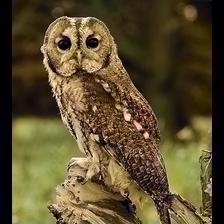
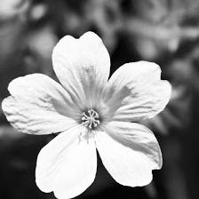
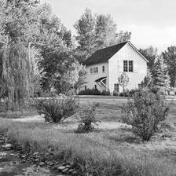
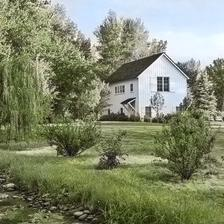

# Automatic Image Colorization using CNNs and InceptionResnetV2
## Overview
This project showcases my implementation of Baldassarre et al.'s [Deep Koalarization: Image Colourization using CNNs and Inception-ResNet-v2](https://arxiv.org/abs/1712.03400) paper from 2017 using PyTorch. The network is trained using 60 000 images from ImageNet. You can find more information in the Jupyter notebook.

## Results
More results can be found in the notebook and the image results folder.

 

 

 

 

 

 

 

## Built With
- [PyTorch](https://pytorch.org/)
- [Pretrained-Models.PyTorch](https://github.com/Cadene/pretrained-models.pytorch) - Leveraged InceptionResnetV2
- [ImageNet Downloader](https://github.com/mf1024/ImageNet-Datasets-Downloader) - Downloading the dataset

## Credits
Here are the implementations that gave me inspiration for this project:
- [deep-koalarization - baldassarreFe](https://github.com/baldassarreFe/deep-koalarization)
- [Automatic-Image-Colorization - lukemelas](https://github.com/lukemelas/Automatic-Image-Colorization/)
- [hands-on-transfer-learning-with-python - dipanjanS](https://github.com/dipanjanS/hands-on-transfer-learning-with-python)

## Author
Laura Dang
